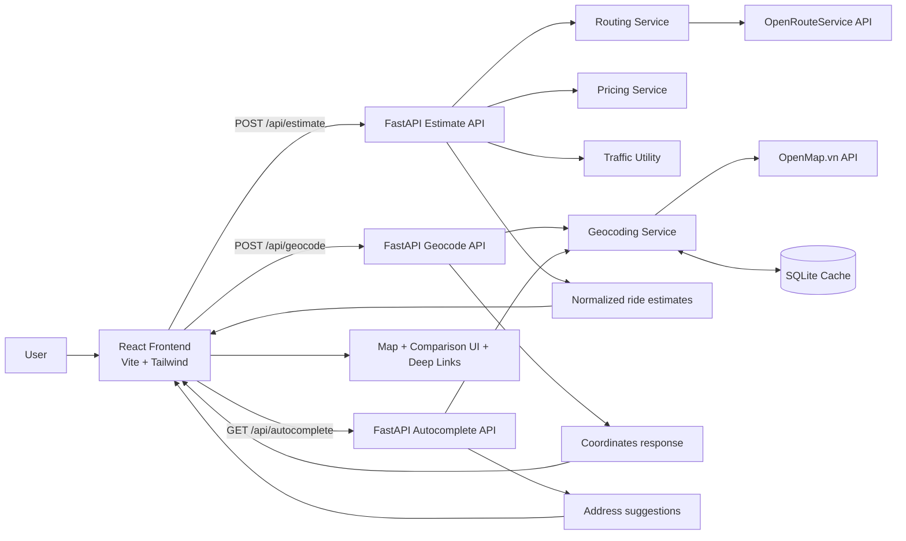

# ReRides VN 🛵🚗

ReRides VN is a ride-hailing aggregator application for Vietnam. It allows users to instantly compare prices and estimated arrival times (ETAs) across major platforms such as: Grab, Be, and Xanh SM,.. for both Bike and Car services.

***Website link:*** https://rerides-vn.vercel.app

*Mock client:* https://dhp-exe.github.io/reridesVN
## ✨ Features

- **Multi-Provider Comparison:** Real-time price comparison for Grab, Be, and Xanh SM.
- **Vehicle Options:** Switch easily between Bike (Motorbike) and Car (4-seater).
- **Visual Route Map:** Interactive map showing the exact route and pickup/dropoff points (powered by **Leaflet** & **OpenRouteService**).
- **Smart Geocoding:** - **OpenMap.vn** for accurate Vietnamese address search.
  - **SQLite Caching** to minimize API costs and speed up repeated searches.
- **Real-time Routing:** Accurate distances and duration estimates via **OpenRouteService**.
- **Traffic Logic:** Dynamic pricing adjustments based on rush hour traffic.
- **Deep Linking:** One-click booking to open the specific ride directly in the provider's app.
- **Dockerized:** Fully containerized for easy deployment.

## 🛠️ Tech Stack

### Frontend
- **Framework:** React 18 (Vite)
- **Language:** TypeScript
- **Styling:** Tailwind CSS
- **Map Library:** React Leaflet
- **Server:** Nginx (in Docker)

### Backend
- **Framework:** FastAPI (Python 3.9+)
- **Database:** SQLite (for caching geocodes)
- **Routing Engine:** OpenRouteService API
- **Geocoding Engine:** OpenMap.vn API
- **Server:** Uvicorn
### Deployment
- **Frontend:** Vercel
- **Backend:** Render

## 🏗️ Architecture
### Overview
ReRides VN follows a client-server architecture with a React frontend calling a FastAPI backend. The frontend handles user input, route visualization, and comparison UI, while the backend coordinates routing, pricing, traffic adjustment, geocoding, and cached place lookups. External providers are abstracted behind service modules so the API can return a single normalized comparison payload to the client.
### System flow


## 📘 API Documentation

| Method | Endpoint | Description |
| --- | --- | --- |
| `POST` | `/api/estimate` | Calculates route distance, trip duration, traffic factor, and estimated prices for supported ride providers based on pickup, dropoff, and vehicle type. |
| `POST` | `/api/geocode` | Converts a user-provided address into latitude and longitude coordinates. |
| `GET` | `/api/autocomplete` | Returns address or place suggestions for a search query, optionally biased by the user's current latitude and longitude. |

## 🚀 Getting Started ( using Docker)

The easiest way to run the project is using Docker. This will set up the Frontend, Backend, and Nginx proxy automatically.

### Prerequisites
- [Docker Desktop](https://www.docker.com/products/docker-desktop/) installed and running.
- API Keys for **OpenRouteService** and **OpenMap.vn**.

### Steps
1. **Clone the repository:**
   ```bash
   git clone https://github.com/dhp-exe/reridesVN.git
    ```
2. **Configure Environment:**
 Create a ```.env``` file in the ```backend/``` folder:

    ```
    ORS_API_KEY=your_openrouteservice_key
    OPENMAP_API_KEY=your_openmap_key
    ```
3. **Run with Docker Compose:**
    ```bash
    docker-compose up --build
    ```

4. **Access the App:** Open your browser at http://localhost:3000.

## ⚙️ Manual Setup (For Development)

If you want to run the services individually without Docker.

### Prerequisites
- **Node.js** (v18+ recommended)
- **Python** (v3.9+)
- **OpenRouteService API Key:** Get a free key from [openrouteservice.org](https://openrouteservice.org/).
- **OpenMap.vn API Key:** Get a free key from [openmap.vn](https://openmap.vn/).

### 1. Backend Setup

Navigate to the backend directory:
```bash
cd backend
```
Create a virtual environment (optional but recommended):

```bash
python -m venv venv

# Windows
venv\Scripts\activate
# macOS/Linux
source venv/bin/activate
```
Install dependencies:

```bash
pip install -r requirements.txt
```
Configure Environment Variables: Create a .env file in the backend folder and add your API key:

```
# Routing
ORS_API_KEY=your_openrouteservice_api_key_here

# Geocoding & Autocomplete
OPENMAP_API_KEY=your_openmap_api_key_here
```
Start the server:

```bash
uvicorn app.main:app --reload
```
The API will be available at http://localhost:8000.

### 2. Frontend Setup
Navigate to the frontend directory:

```bash
cd frontend
```
Install dependencies:

```bash
npm install
```

Run the development server:

```
npm run dev
```
Open your browser at http://localhost:5173.

## 📂 Project Structure
```
.
├── docker-compose.yml    # Orchestrates Frontend & Backend
├── backend/
│   ├── app/
│   │   ├── api/          # Endpoints (estimate, geocode)
│   │   ├── services/     # Logic (Routing, Pricing, Caching)
│   │   ├── core/         # Config & Database logic
│   │   └── main.py       # Entry point
│   ├── app.db            # SQLite Cache
│   ├── Dockerfile        # Backend Image config
│   └── requirements.txt
├── frontend/
│   ├── src/
│   │   ├── components/   # UI Components (Map, ServiceRow)
│   │   ├── screens/      # App Screens (Input, Comparison)
│   │   └── services/     # API Adapters
│   ├── Dockerfile        # Frontend Image config
│   └── nginx.conf        # Nginx Proxy config
└── README.md
```
## 📄 License
This project is open source.